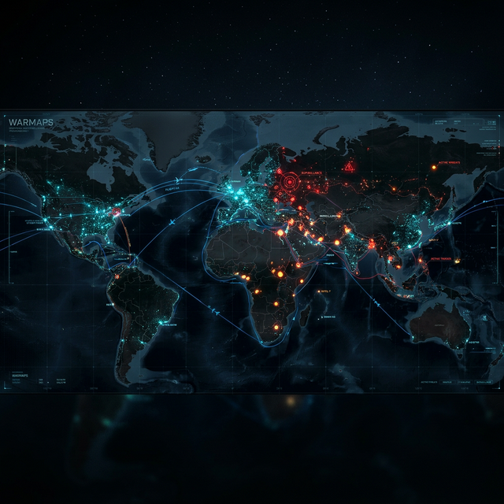

<p align="center">
  
</p>

<p align="center">
  <b>Real-time OSINT intelligence dashboard on an infinite canvas.</b>
</p>

<p align="center">
  <a href="https://warmaps.live"></a>
  <a href="LICENSE"></a>
  
</p>

---

WARMAPS is a geospatial intelligence platform that aggregates conflict data, OSINT channels, prediction markets, and live media onto an infinite 2D canvas with draggable, resizable widgets.

**Before:** Monitoring open-source intelligence means juggling 10+ browser tabs — Telegram channels, flight trackers, fire maps, news feeds, prediction markets — and manually correlating events across them.

**After:** WARMAPS puts everything on a single infinite canvas, cross-referencing events geographically, with live data feeds updating every 15 seconds.

## ✨ What You Get

Every deployment automatically:

- 🗺️ **MapLibre GL** tactical dark map with GPU-rendered layers (fires, flights, events, assets)
- 📡 **Telegram OSINT** — polls 23 intelligence channels every 15s via gramJS
- 🔥 **NASA FIRMS** satellite fire detection (global wildfire tracking)
- ✈️ **ADSB.lol** military flight tracking with aircraft type classification
- ⚔️ **ACLED** kinetic strike events with cross-referencing via GDELT
- 📊 **Prediction Markets** — Polymarket/Kalshi threat radar
- 📺 **Live TV** — Al Jazeera, France24, DW News embeds
- 🤖 **AI Analyst** — Gemini-powered chat with full context awareness
- 🎰 **SOL Betting** — native Phantom wallet wagers on geopolitical outcomes

## 🖥️ Infinite Canvas Architecture

WARMAPS is not a fixed dashboard — it's an **infinite 2D canvas** powered by the [GalaxyDraw](https://github.com/7flash/git-on-canvas) engine:

| Feature | Details |
|---------|---------|
| **13 widget types** | Map, news, telegram, intel panel, AI chat, live TV, betting, and more |
| **Drag & drop from tray** | Bottom widget tray with category filtering |
| **Snap guidelines** | Blue alignment guides when dragging widgets near each other |
| **Minimap** | Color-coded overview of all widget positions |
| **Layout persistence** | Auto-saves to localStorage — survives refreshes |
| **Sharable layouts** | 🔗 exports layout as base64 URL parameter |
| **Detachable windows** | Pop any widget out for multi-monitor setups |
| **Widget sync** | Lock map widgets to synchronized pan/zoom/pitch |
| **Auto-arrange** | One-click masonry tiling of all widgets |
| **Collaborative** | WebSocket-based layout sync with peer cursors |

## 🚀 Setup

```bash
bun install
```

Create a `.config.toml`:

```toml
[server]
port = 4444

[telegram]
api_id = "YOUR_API_ID"
api_hash = "YOUR_API_HASH"
phone = "+1234567890"
```

## ⚡ Run

```bash
bun run server.ts
```

Server starts at `http://localhost:4444`. Caddy reverse proxy recommended for HTTPS in production.

## 📐 Architecture

```
starwar/
├── server.ts              # Melina.js server + WebSocket sync
├── app/
│   ├── page.tsx           # Server-rendered HTML shell
│   ├── page.client.tsx    # Thin orchestrator (~150 lines)
│   ├── globals.css        # Design system
│   └── lib/
│       ├── warmaps-canvas.ts  # GalaxyDraw adapter (pan/zoom/drag/resize)
│       ├── widgets.ts         # 13 widget types, instance management
│       ├── data.tsx           # WebWorker-powered data layer
│       ├── feeds.tsx          # Virtual-scrolled news/telegram feeds
│       ├── map.tsx            # MapLibre GL with 3D terrain
│       ├── cache.ts           # IndexedDB cache-first layer
│       ├── sync.ts            # WebSocket collaborative editing
│       └── virtual-feed.tsx   # Sentinel spacer virtual scroll
├── src/
│   └── telegram.ts        # gramJS Telegram OSINT poller
└── .config.toml           # Secrets (gitignored)
```

### Data Sources

| Source | Update Interval | Method |
|--------|----------------|--------|
| NASA FIRMS | 5 min | REST API |
| ADSB.lol | 5 min | REST API |
| GDELT | 30 min | REST API |
| ACLED | 30 min | REST API |
| Telegram | 15 sec | gramJS polling |
| Seismic (USGS) | 5 min | REST API |
| Prediction Markets | 15 min | REST API |
| Crypto/Pumpfun | 15 min | REST API |

All data sources use a **cache-first** strategy via IndexedDB (~5ms boot from cache, then background refresh).

### Performance

- **Page orchestrator**: 150 lines — imports 16 modules
- **Virtual feeds**: Only ~15 DOM nodes rendered at a time (capacity 200+ items)
- **Data workers**: WebWorkers for GDELT/Flights/Fires GeoJSON processing
- **Viewport culling**: Off-screen widgets deferred via GalaxyDraw CardManager

## 🌐 Production Deployment

```bash
# On server
git pull && bun install
bun run server.ts  # Port 4444

# Caddy config
warmaps.live {
    reverse_proxy localhost:4444
}
```

## License

MIT
